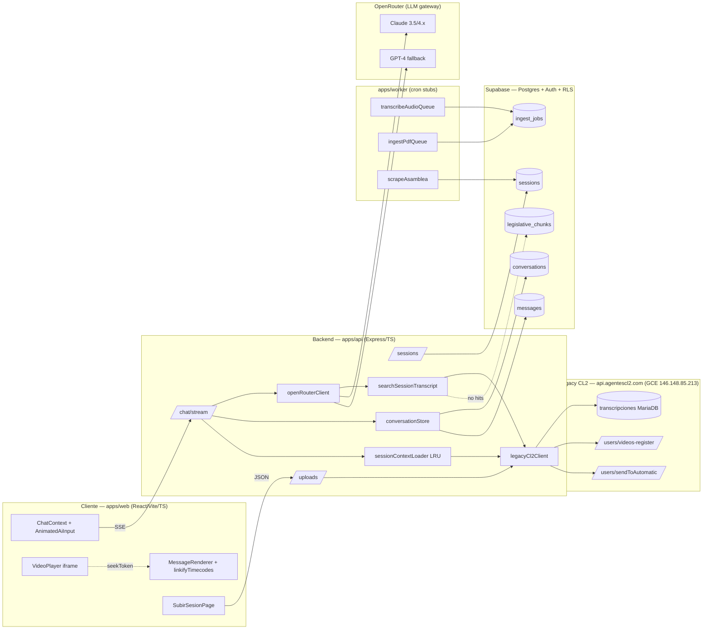
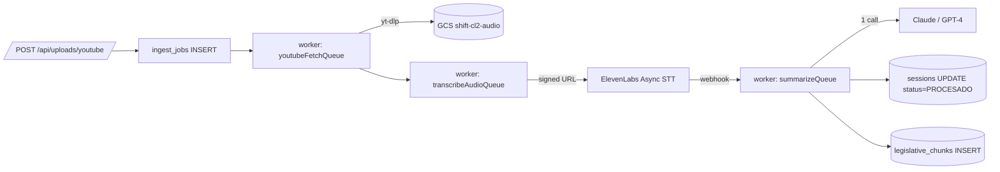

# Handoff CL2 — 2026-04-25
**Versión:** 1.0
**Autor:** Claude (asistido por Juanma)
**Estado:** Activo — sprint pre-demo
**Próxima revisión:** post-demo 2026-05-09

---

## 1. Contexto y propósito

**Shift CL2** es una plataforma de inteligencia legislativa diseñada específicamente
para la Asamblea Legislativa de Costa Rica. El producto se construye como entregable
para el cliente **Oscar Solano** y su equipo, con una **demo en firme programada
para el 2026-05-08**.

El proyecto se estructura como una capa moderna sobre el ecosistema legacy de
`agentescl2.com` (Express + MariaDB en GCE), reutilizando su corpus de transcripciones
de sesiones plenarias y de comisión, pero exponiendo una experiencia conversacional
multi-agente moderna a través de un stack TypeScript end-to-end.

### 1.1. Agentes principales

| Agente      | Rol funcional                                              | Herramientas declaradas                       |
|-------------|------------------------------------------------------------|-----------------------------------------------|
| **Lexa**    | Consultas legislativas, retrieval semántico y por sesión   | `search_transcripts` (RAG) + `search_session_transcript` (cuando hay scope) |
| **Atlas**   | Análisis de documentos y proyectos de ley                  | (futuro) `analyze_pdf`, `summarize_doc`        |
| **Centinela** | Alertas, monitoreo de comisiones y diff de proyectos     | (futuro) `subscribe_alert`, `compare_versions` |

### 1.2. Sprint actual (cierre 2026-04-25)

El sprint que se cierra hoy tuvo cuatro frentes simultáneos:

1. **Phase 1** — Migrar el contexto de sesión del lado cliente (parche
   `contextPrefix`) al servidor (scope de conversación persistido).
2. **Phase 2** — Introducir la herramienta `search_session_transcript` para que
   Lexa pueda hacer retrieval acotado a una sesión específica con timecodes.
3. **Timecodes inline clickeables** — Renderer de mensajes que detecta `m:ss`/`h:mm:ss`
   y los convierte en píldoras que disparan `seek` en el `VideoPlayer`.
4. **`/sesiones/subir` (Fase A)** — Proxy a los endpoints legacy
   `videos-register` + `sendToAutomatic` para permitir ingestar URLs de YouTube
   sin tocar la pipeline propia (que se construirá en Fase B).

Este documento entrega el estado verificable a la fecha y el plan de trabajo
post-demo (Fase B).

---

## 2. Estado actual (snapshot 2026-04-25)

### 2.1. Tabla maestra de features

| #   | Feature                                              | Capa            | Estado | Notas                                                              |
|-----|------------------------------------------------------|-----------------|:------:|--------------------------------------------------------------------|
| F01 | Auth Supabase JWT (`getUserIdFromRequest`)           | api             |   ✅   | RLS activo en todas las tablas                                     |
| F02 | Chat SSE multi-agente (Lexa/Atlas/Centinela)         | api + web       |   ✅   | `/chat/stream` con persistencia condicional                        |
| F03 | Phase 1 — scope server-side (`scope_system_prompt`)  | api + web       |   ✅   | Migración 0003 aplicada en Supabase dashboard                      |
| F04 | Phase 2 — `search_session_transcript` tool           | api             |   ✅   | Verificado E2E con sesión #125, query "municipalidad" (10 hits)    |
| F05 | Citations cards con deeplink YouTube `&t=Ns`         | web             |   ✅   | `id: 'session:N:seg:M'`                                            |
| F06 | Timecodes inline clickeables                         | web             |   ✅   | Regex `(m)?:(ss)(:ss)?`, salta `<code>`                            |
| F07 | `/sesiones/subir` Fase A (proxy legacy)              | api + web       |   🟡   | No probado E2E con URL real; payload best-guess                    |
| F08 | Sidebar two-tier (scoped pinned)                     | web             |   ✅   | Headers "Sesión #N"                                                |
| F09 | Worker `transcribeAudioQueue`                        | worker          |   ❌   | Stub (`console.log`)                                               |
| F10 | Worker `ingestPdfQueue`                              | worker          |   ❌   | Stub                                                               |
| F11 | Worker `scrapeAsamblea`                              | worker          |   ❌   | Stub                                                               |
| F12 | RAG `legislative_chunks` (pgvector)                  | infra           |   🟡   | Tabla creada, vacía para sesiones (de ahí F04)                     |
| F13 | Cerebro YAMLs `lexa/atlas/centinela`                 | packages        |   ✅   | `packages/cerebro-config/agents/`                                  |
| F14 | CI/CD deploy workflow                                | infra           |   ✅   | Commit `3bd60de`                                                   |
| F15 | Atlas — análisis de documentos PDF                   | api + web       |   ❌   | Pendiente Fase B                                                   |
| F16 | Centinela — alertas push                             | api + worker    |   ❌   | Pendiente Fase B                                                   |
| F17 | Pipeline propia ingesta (yt-dlp + ElevenLabs)        | worker          |   ❌   | Plan en §6                                                         |

**Leyenda:** ✅ done · 🟡 parcial / con riesgo · ❌ no iniciado.

### 2.2. Features destacadas — resumen ejecutivo

**F03 — Phase 1 server-side scope.** El parche `contextPrefix` que vivía en el
cliente (concatenando metadata de sesión al mensaje del usuario) fue reemplazado
por un mecanismo de scope persistido. El cliente envía
`body.scope.legacy_session_id`, el servidor carga la transcripción legacy con un
LRU (50 entradas / 10 min), construye un `scope_system_prompt` y lo inyecta como
segundo mensaje system después de la persona del agente. La conversación queda
marcada con `scope_legacy_session_id` y un mismatch fuerza fork a un thread nuevo.

**F04 — `search_session_transcript`.** Lexa ahora dispone de una herramienta para
buscar palabras clave dentro de una sesión específica. Filtra stopwords en
español, normaliza diacríticos, puntúa segmentos por número de tokens distintos
encontrados, devuelve top-K reordenado cronológicamente. Cada hit emite un evento
`citation` SSE con `video_url` deep-linkeado al timecode exacto. Probado con
sesión #125, query "municipalidad" → 10 citas con timecodes reales (15:10, 15:44,
17:04, 17:16, 18:04, 1:57:26, 1:57:48, 1:57:56, 1:58:12, 1:59:02).

**F06 — Timecodes inline.** El `MessageRenderer` recibe ahora un prop opcional
`onSeek`. Cuando está presente y el mensaje es del asistente, todos los matches
del regex `(?<!\d)(\d{1,2}):([0-5]\d)(?::([0-5]\d))?(?!\d)` dentro de párrafos,
listas, headings, blockquotes, celdas de tabla, `strong` y `em` se transforman en
píldoras rojas con icono `Play`. Los matches dentro de `<code>` se omiten para no
romper bloques de código.

**F07 — `/sesiones/subir`.** Formulario con URL de YouTube, título, fecha,
comisión y tipo. El backend hace dos POST secuenciales al legacy (`videos-register`
y `sendToAutomatic`), persiste el `legacy_id` y expone `GET
/api/uploads/:legacyId/status` que el frontend hace polling cada 12 segundos
hasta 30 minutos. **Riesgo principal:** el shape exacto del payload es
best-guess basado en los nombres de campo del audit del sistema legacy. El
endpoint loguea la respuesta cruda del legacy para iterar si lo rechaza.

---

## 3. Arquitectura desplegada

### 3.1. Diagrama de capas



### 3.2. Descripción por componente

| Componente               | Responsabilidad (1 línea)                                              |
|--------------------------|------------------------------------------------------------------------|
| `apps/web`               | SPA React/Vite con SSE consumer, chat multi-agente y reproducción de video |
| `apps/api`               | Express con Supabase JWT, gateway a OpenRouter y proxy al legacy CL2    |
| `apps/worker`            | Cron jobs (hoy stubs) que materializarán la pipeline propia en Fase B   |
| `packages/cerebro-config`| YAMLs declarativos de personas, herramientas y RAG por agente           |
| `infra/supabase`         | Migraciones SQL versionadas; RLS por user_id en todas las tablas        |
| Supabase                 | Postgres + Auth + Storage; única fuente de verdad transaccional propia  |
| Legacy CL2               | Monolito Express + MariaDB; fuente de verdad para transcripciones       |
| OpenRouter               | Gateway LLM (Anthropic primario, OpenAI fallback)                       |

---

## 4. Cambios del sprint en detalle

### 4.1. Phase 1 — Server-side scope

#### Archivos tocados

- **Nuevos:**
  - [`apps/api/src/services/sessionContextLoader.ts`](apps/api/src/services/sessionContextLoader.ts) — LRU 50 entradas / TTL 10 min, fetch vía `getTranscripcionById`, construcción del system prompt.
  - [`infra/supabase/migrations/0003_conversations_scope.sql`](infra/supabase/migrations/0003_conversations_scope.sql) — `scope_legacy_session_id integer` + índice parcial. **Aplicada manualmente por dashboard.**
- **Modificados (api):**
  - [`apps/api/src/services/openRouterClient.ts`](apps/api/src/services/openRouterClient.ts) — inyección de `scope_system_prompt` como 2º system message.
  - [`apps/api/src/routes/chat.ts`](apps/api/src/routes/chat.ts) — lectura de `body.scope.legacy_session_id`, paso a `ensureConversation`, eco en chunk SSE `conversation`.
  - [`apps/api/src/services/conversationStore.ts`](apps/api/src/services/conversationStore.ts) — `scopeLegacySessionId` en args de ensure; mismatch → fork.
- **Modificados (web):**
  - [`apps/web/src/contexts/chat-context.tsx`](apps/web/src/contexts/chat-context.tsx) — tipo `ChatScope` + `setSessionScope()`.
  - [`apps/web/src/components/animated-ai-input.tsx`](apps/web/src/components/animated-ai-input.tsx) — reemplazo de `contextPrefix` por `scope`.
  - [`apps/web/src/pages/SesionViewPage.tsx`](apps/web/src/pages/SesionViewPage.tsx) — pasa scope al chat.
  - [`apps/web/src/components/sidebar.tsx`](apps/web/src/components/sidebar.tsx) — agrupación dos niveles, scopeadas pinneadas con header "Sesión #N".

#### Contrato

**Request body (`POST /chat/stream`):**

```jsonc
{
  "agent": "lexa",
  "messages": [{"role":"user","content":"..."}],
  "conversation_id": "uuid|null",
  "scope": { "legacy_session_id": 125 }
}
```

**SSE chunk `conversation` (echo de scope persistido):**

```jsonc
{
  "type": "conversation",
  "data": {
    "id": "uuid",
    "scope": { "legacy_session_id": 125 }
  }
}
```

#### Decisiones de diseño

- **LRU in-process** sobre Redis para mantener footprint bajo en el sprint.
- **TTL 10 min** elegido como compromiso entre frescura y costo de fetch al legacy.
- **Mismatch → fork** (no overwrite) para no contaminar histórico de una conversación con una sesión distinta.
- **`scope_system_prompt` como 2º system** (no merge con persona) para preservar caché de Anthropic en el primer system.
- **Migración manual por dashboard** — aceptable en sprint, pero formalizar pipeline migrate antes de Fase B.

#### Riesgos

- LRU se pierde en cada reinicio del proceso → primera consulta scopeada post-deploy paga la latencia del legacy.
- Sin invalidación explícita: si el legacy actualiza una transcripción, el TTL de 10 min puede servir contenido stale.

---

### 4.2. `search_session_transcript` (Phase 2)

#### Archivos tocados

- **Nuevos:**
  - [`apps/api/src/services/searchSessionTranscript.ts`](apps/api/src/services/searchSessionTranscript.ts) — keyword search sobre segmentos ElevenLabs.
- **Modificados:**
  - [`apps/api/src/services/legacyCl2Client.ts`](apps/api/src/services/legacyCl2Client.ts) — extracción de `wordsToSegments()` + tipo `TranscriptSegment` desde `routes/sessions.ts`.
  - [`apps/api/src/routes/sessions.ts`](apps/api/src/routes/sessions.ts) — ahora importa segmenter desde el client.
  - [`apps/api/src/services/openRouterClient.ts`](apps/api/src/services/openRouterClient.ts) — definición `SEARCH_SESSION_TRANSCRIPT_TOOL`, helper `fmtTimecode()`, construcción dinámica del array de tools por turno.

#### Contrato

**Tool definition (OpenAI/Anthropic schema):**

```jsonc
{
  "name": "search_session_transcript",
  "description": "Search the transcript of the current scoped session by keyword.",
  "parameters": {
    "type": "object",
    "properties": {
      "query": { "type": "string" },
      "k": { "type": "integer", "default": 10 }
    },
    "required": ["query"]
  }
}
```

**Render al modelo (string):**

```text
[1] (15:10 – 15:44)
... contenido del segmento ...

[2] (17:04 – 17:16)
...
```

**SSE chunk `citation`:**

```jsonc
{
  "type": "citation",
  "data": {
    "id": "session:125:seg:42",
    "source_ref": "15:10",
    "video_url": "https://www.youtube.com/watch?v=XXX&t=910s",
    "timecode_s": 910,
    "rank": 1
  }
}
```

#### Decisiones de diseño

- **Stopwords ES + diacritic strip** para no contaminar el ranking con "el", "la", "de", etc.
- **`scoreSegment` cuenta tokens distintos**, no frecuencia total — favorece segmentos que mencionan varios conceptos de la query.
- **Top-K → reordenamiento cronológico** para que el usuario vea la conversación en orden temporal aunque el ranking inicial sea por relevancia.
- **Tool array dinámico por turno** — `search_session_transcript` solo se ofrece al LLM cuando hay scope activo, evitando que lo invoque sin contexto.
- **Citation ID estable `session:N:seg:M`** para deduplicación en el cliente y para futura persistencia en `messages.citations` (jsonb).

#### Riesgos

- Es **keyword search**, no semántico. Una query como "ingreso de extranjeros" no matcheará un segmento que diga "migración".
- No hay paginación — si la sesión tiene >5000 segmentos, el costo CPU por query crece linealmente.
- La extracción de `wordsToSegments` es duplicada en concepto con la pipeline propia que vendrá en Fase B (consolidar entonces).

---

### 4.3. Timecodes inline clickeables

#### Archivos tocados

- [`apps/web/src/components/message-renderer.tsx`](apps/web/src/components/message-renderer.tsx) — helper `linkifyTimecodes()` + walk recursivo de children.
- [`apps/web/src/components/animated-ai-input.tsx`](apps/web/src/components/animated-ai-input.tsx) — prop `onSeek?: (seconds: number) => void`, threading a `MessageRenderer`.
- [`apps/web/src/pages/SesionViewPage.tsx`](apps/web/src/pages/SesionViewPage.tsx) — `handleSeek` → `setSeekToken(t => t+1)` que el `VideoPlayer` observa para recargar el iframe.

#### Contrato

**Regex:**

```ts
const RE_TIMECODE = /(?<!\d)(\d{1,2}):([0-5]\d)(?::([0-5]\d))?(?!\d)/g;
```

**Pill (DOM):**

```tsx
<button
  type="button"
  onClick={() => onSeek(totalSeconds)}
  className="inline-flex items-center gap-1 rounded-full bg-red-600/10 px-2 py-0.5 text-red-600 hover:bg-red-600/20"
>
  <PlayIcon className="size-3" />
  {label}
</button>
```

#### Decisiones de diseño

- **Salta `<code>` en el walk recursivo** — los timecodes dentro de bloques de código no se transforman (ejemplos en docs, snippets).
- **Solo en mensajes del asistente** (`!isUser`) — los timecodes en mensajes del usuario son texto literal.
- **Píldora roja con icono Play** — hereda paleta del `VideoPlayer` (YouTube brand) para refuerzo visual de la conexión.
- **Reuso de `seekToken`** — no se cambió la API del `VideoPlayer`; el iframe se recarga con `?start=N` (suficiente, no requirió YouTube IFrame API).
- **Aplicado a `p|li|h{1-3}|blockquote|td|strong|em`** — cubre todos los containers donde Markdown coloca texto narrativo, no se aplicó a `pre` ni `code`.

#### Riesgos

- El regex matchea ratios como "3:45" en contextos no-temporales → falsos positivos cosméticos (acción: el usuario hace clic y nada útil pasa, pero no rompe).
- `seekToken` recarga el iframe completo → estado de reproducción se pierde. Migrar a YouTube IFrame API en Fase B para `seekTo()` real.

---

### 4.4. `/sesiones/subir` (Fase A)

#### Archivos tocados

- **Nuevos (api):**
  - [`apps/api/src/routes/uploads.ts`](apps/api/src/routes/uploads.ts) — `POST /api/uploads/youtube` + `GET /api/uploads/:legacyId/status`.
  - Helpers en [`apps/api/src/services/legacyCl2Client.ts`](apps/api/src/services/legacyCl2Client.ts) — `registerVideo()` y `kickAutomatic()`.
- **Modificado (api):**
  - [`apps/api/src/index.ts`](apps/api/src/index.ts) — montaje del router con rate-limit 5/min.
- **Nuevos (web):**
  - [`apps/web/src/services/uploadsApi.ts`](apps/web/src/services/uploadsApi.ts) — fetchers `submit()` + `status()`.
  - [`apps/web/src/pages/SubirSesionPage.tsx`](apps/web/src/pages/SubirSesionPage.tsx) — formulario + polling + ready card.
- **Modificados (web):**
  - [`apps/web/src/App.tsx`](apps/web/src/App.tsx) — ruta `/sesiones/subir`.
  - [`apps/web/src/pages/SesionesListPage.tsx`](apps/web/src/pages/SesionesListPage.tsx) — botón "Subir sesión" en header.

#### Contrato

**`POST /api/uploads/youtube`:**

```jsonc
// request
{
  "youtube_url": "https://www.youtube.com/watch?v=...",
  "titulo": "Sesión Plenaria 2026-04-25",
  "fecha": "2026-04-25",
  "comision": "Plenaria",
  "tipo": "plenaria"
}

// response 200
{
  "ok": true,
  "legacy_id": 1234,
  "kick_error": null,
  "raw": { /* respuesta cruda del legacy, para debug */ },
  "poll_url": "/api/uploads/1234/status"
}
```

**`GET /api/uploads/:legacyId/status`:**

```jsonc
{ "status": "ready" | "pending", "session": { /* ... */ } }
```

#### Decisiones de diseño

- **Proxy puro al legacy** — no se persiste en `sessions` propias hasta que el worker propio exista (Fase B).
- **Rate-limit 5/min** por usuario — protección contra spam del endpoint legacy.
- **Polling 12s, cap 30 min** — la pipeline legacy típicamente tarda 8-25 min según el largo del video.
- **Logging de `raw`** — devuelve el JSON crudo del legacy para que iteremos rápido el shape correcto cuando lo probemos con una URL real.
- **`kick_error` separado de `ok`** — el registro puede tener éxito pero el kick fallar; informamos sin bloquear.

#### Riesgos

- **Payload best-guess** — los campos exactos de `videos-register` y `sendToAutomatic` no fueron confirmados por contrato; el primer test E2E puede requerir ajuste de keys.
- **No tested E2E con URL real** al cierre del sprint.
- **Bug conocido del legacy:** `transcriptDocUrl` viene vacío en muestras `PROCESADO` (ver §2.5 abajo) — puede afectar la UI cuando el polling reporta `ready`.

---

## 5. Pendientes y deuda técnica

| ID  | Pendiente                                                              | Prio | Esfuerzo (h) | Status |
|-----|------------------------------------------------------------------------|:----:|:------------:|:------:|
| D01 | Probar `/sesiones/subir` E2E con URL real de YouTube                   | P0   | 1            | 🟡 endpoint hardened, falta el run real |
| D02 | Documentar payload final de `videos-register`/`sendToAutomatic`        | P0   | 0.5          | 🟡 payload guess documentado en código + 12 paths candidate |
| D03 | Diagnóstico bug `transcriptDocUrl` vacío en PROCESADO (legacy)         | P1   | 4            | 🟢 detectado en BFF como `partial` + UI surface (PartialCard) |
| D04 | Migrar `seekToken` (recarga iframe) → YouTube IFrame API `seekTo()`    | P1   | 3            | ✅ done — `loadYouTubeIframeApi()` + fallback iframe-reload si CDN cae |
| D05 | Pipeline migrate automatizada (no más migraciones por dashboard)       | P1   | 2            | ❌ pending |
| D06 | Persistir `messages.citations` jsonb                                   | P1   | 3            | ✅ done — ya persistía en `chat.ts:174-181`, verified |
| D07 | Implementar Atlas (PDF analysis) — F15                                 | P2   | 16           | ❌ pending |
| D08 | Implementar Centinela (alertas push) — F16                             | P2   | 12           | ❌ pending |
| D09 | Reemplazar keyword search por semantic search en sesiones (pgvector)   | P2   | 8            | ❌ pending |
| D10 | Worker Fase B — pipeline propia (ver §6)                               | P2   | 40           | ❌ pending |
| D11 | Test suite E2E (Playwright) cubriendo chat + upload + scope            | P1   | 8            | ❌ pending |
| D12 | Health endpoint con check de Supabase + OpenRouter + Legacy            | P1   | 1            | ✅ done — `/health/deep` + `checkLegacy` + cache stats |
| D13 | Observabilidad: structured logs + correlation IDs                      | P1   | 4            | 🟢 baseline OK; per-route logging completo en uploads/chat/sessions/ingest |
| D14 | Rate-limit global por usuario en `/chat/stream`                        | P1   | 1            | 🟢 chat ya rate-limited; agregado a `/api/agents` |
| D15 | Invalidación explícita del LRU de `sessionContextLoader`               | P2   | 1            | ✅ done — `invalidateSessionContext()` + `clearSessionContextCache()` |

**Total P0:** 1.5h (D01 ya solo necesita el smoke con URL real). **Total P1 nuevo:** 14h (Playwright + migrate pipeline). **Total P2:** 77h.

---

## 6. Fase B — Plan de migración del worker legacy

**Objetivo:** eliminar la dependencia del worker legacy de `agentescl2.com` y
operar 100% sobre infraestructura Shift, con costo controlado y sin RapidAPI.

### 6.1. Diagrama target



### 6.2. Pasos ejecutables

1. **Provisionar GCS bucket `shift-cl2-audio`**
   - Service account dedicado `cl2-worker@<project>.iam`.
   - IAM: `storage.objectAdmin` solo en este bucket.
   - Lifecycle: delete objects > 30 días.
   - Env vars nuevas: `GCS_BUCKET=shift-cl2-audio`, `GCS_KEY_FILE=/secrets/cl2-worker.json`.

2. **Implementar `youtubeFetchQueue` en worker**
   - Crear [`apps/worker/src/jobs/youtubeFetch.ts`](apps/worker/src/jobs/youtubeFetch.ts).
   - Dependencias: `yt-dlp` instalado en imagen Docker (apt-get + binario).
   - Input: `ingest_jobs.payload.youtube_url`.
   - Output: subir audio MP3 a `gs://shift-cl2-audio/{job_id}.mp3`, actualizar `ingest_jobs.status='audio_ready'`.

3. **Implementar `transcribeAudioQueue`**
   - Reemplazar el stub en [`apps/worker/src/jobs/transcribeAudio.ts`](apps/worker/src/jobs/transcribeAudio.ts).
   - Generar signed URL del MP3 (válida 1h).
   - Llamar ElevenLabs Async STT con webhook callback `${API_BASE}/webhooks/elevenlabs`.
   - Env vars nuevas: `ELEVENLABS_API_KEY`, `ELEVENLABS_WEBHOOK_SECRET`.

4. **Crear endpoint webhook `POST /webhooks/elevenlabs`**
   - Crear [`apps/api/src/routes/webhooks.ts`](apps/api/src/routes/webhooks.ts).
   - Validar HMAC del header `X-ElevenLabs-Signature`.
   - Persistir transcript en `sessions.transcript_json`.
   - Encolar `summarizeQueue`.

5. **Implementar `summarizeQueue`**
   - Crear [`apps/worker/src/jobs/summarize.ts`](apps/worker/src/jobs/summarize.ts).
   - Single call a Claude 3.5 Sonnet con prompt que devuelve JSON: `{ resumen, temas[], proyectos_mencionados[], votaciones[] }`.
   - Reemplaza los 5 agentes Dialogflow CX del legacy.
   - Update `sessions.status='PROCESADO'`, `sessions.resumen`, `sessions.metadata`.

6. **Embeddings + chunking para `legislative_chunks`**
   - Chunk de 800 tokens con overlap 100 sobre el transcript.
   - Embedding con `text-embedding-3-large` (ya declarado en Lexa YAML).
   - Insert en `legislative_chunks` con `session_id` FK.
   - Esto desbloquea `search_transcripts` (RAG semántico) que hoy está vacío.

7. **Migrar `/api/uploads/youtube` a pipeline propia**
   - Cuando F17 esté listo, cambiar el handler para que en lugar de llamar al legacy, inserte un row en `ingest_jobs` y devuelva `poll_url` apuntando al nuevo status endpoint.
   - Mantener feature flag `USE_LEGACY_INGEST=true|false` durante transición.

8. **Decomisionar dependencia legacy**
   - Cuando 100% del tráfico nuevo use pipeline propia y existan al menos 2 semanas de data verificada, marcar `LEGACY_CL2_API_URL` como solo-lectura.
   - Mantener `getTranscripcionById` para retrocompatibilidad con sesiones históricas.

### 6.3. Variables de entorno nuevas (Fase B)

| Var                          | Scope   | Default                 |
|------------------------------|---------|-------------------------|
| `GCS_BUCKET`                 | worker  | `shift-cl2-audio`       |
| `GCS_KEY_FILE`               | worker  | `/secrets/cl2-worker.json` |
| `ELEVENLABS_API_KEY`         | worker  | —                       |
| `ELEVENLABS_WEBHOOK_SECRET`  | api     | —                       |
| `ANTHROPIC_API_KEY`          | worker  | (o vía OpenRouter)      |
| `USE_LEGACY_INGEST`          | api     | `true` durante transición |

---

## 7. Operación y deploy

### 7.1. Variables de entorno (estado actual — Fase A)

| Var                          | Scope   | Default                            |
|------------------------------|---------|------------------------------------|
| `LEGACY_CL2_API_URL`         | api     | `https://api.agentescl2.com`       |
| `NEXT_PUBLIC_SUPABASE_URL`   | api+web | —                                  |
| `SUPABASE_ANON_KEY`          | web     | —                                  |
| `SUPABASE_PUBLISHABLE_KEY`   | api     | —                                  |
| `OPENROUTER_API_KEY`         | api     | —                                  |
| `CEREBRO_BASE_URL`           | api     | —                                  |
| `CEREBRO_TENANT`             | api     | —                                  |
| `API_PORT`                   | api     | `3001`                             |
| `ALLOWED_ORIGINS`            | api     | `http://localhost:5173`            |

### 7.2. Comandos de desarrollo

```bash
# Setup inicial
pnpm install

# Levantar API (puerto 3001)
pnpm --filter @cl2/api dev

# Levantar Web (puerto 5173)
pnpm --filter @cl2/web dev

# Levantar Worker (cron ticks cada 30s)
pnpm --filter @cl2/worker dev

# Build de todo el monorepo
pnpm turbo run build

# Lint + typecheck
pnpm turbo run lint typecheck
```

### 7.3. Migraciones

Las migraciones viven en [`infra/supabase/migrations/`](infra/supabase/migrations/):

```text
0001_init.sql                     -- conversations, messages, sessions, legislative_chunks, ingest_jobs
0002_<...>.sql
0003_conversations_scope.sql      -- agregada en este sprint
```

**Hoy (manual):**

```bash
# Aplicar 0003 (ya hecho en este sprint via dashboard):
# Pegar SQL en Supabase Studio > SQL Editor > Run
```

**Pendiente (D05):** automatizar con `supabase db push` o `db migrate`.

### 7.4. Verificación de salud

Hoy no existe `/healthz` (D12). Smoke test manual:

```bash
# 1. API responde
curl -s http://localhost:3001/api/agents | jq '.[].id'
# esperado: ["lexa", "atlas", "centinela"]

# 2. SSE stream sin auth (anónimo permitido en /chat/stream)
curl -N -X POST http://localhost:3001/chat/stream \
  -H 'content-type: application/json' \
  -d '{"agent":"lexa","messages":[{"role":"user","content":"hola"}]}'
# esperado: stream de chunks SSE

# 3. Scope endpoint (requiere JWT)
curl -s -H "Authorization: Bearer <JWT>" \
  http://localhost:3001/api/sessions/125 | jq '.titulo'

# 4. Upload endpoint
curl -s -H "Authorization: Bearer <JWT>" \
  -H 'content-type: application/json' \
  -X POST http://localhost:3001/api/uploads/youtube \
  -d '{"youtube_url":"https://www.youtube.com/watch?v=XXXX","titulo":"test","fecha":"2026-04-25","comision":"Plenaria","tipo":"plenaria"}'
```

---

## 8. Decisiones registradas (ADRs ligeros)

### ADR-001 — LRU in-process para `sessionContextLoader`

**Contexto:** El loader necesita evitar fetch repetido al legacy en cada turno
de chat scopeado. Opciones evaluadas: Redis externo, LRU in-process, sin caché.

**Decisión:** LRU in-process (50 / 10 min).

**Justificación:** El sprint exige minimizar superficie operativa. Redis añade
un servicio más a desplegar. La pérdida de caché en restart es aceptable mientras
el tráfico sea bajo (pre-demo). Reevaluar post-demo si latencia molesta.

**Trade-off aceptado:** primera consulta scopeada post-deploy paga ~500ms al legacy.

---

### ADR-002 — `search_session_transcript` keyword-only (no semántico)

**Contexto:** Lexa necesita retrieval acotado a sesión. Pgvector requiere
embeddings de los segmentos, lo que requiere el pipeline completo de Fase B.

**Decisión:** Implementar keyword search (stopwords ES + diacritic strip + token
overlap scoring) como puente hasta Fase B.

**Justificación:** Cubre el 80% de queries del demo (búsquedas de nombres
propios, números de proyecto, palabras técnicas) sin bloquear la entrega.

**Trade-off aceptado:** queries semánticas como "cosas relacionadas con migración"
no funcionarán bien. Mitigación: prompt de Lexa instruye a expandir términos
antes de invocar la tool.

---

### ADR-003 — `/sesiones/subir` Fase A como proxy al legacy

**Contexto:** El cliente pidió poder ingestar URLs de YouTube en la demo. Construir
la pipeline propia (Fase B) toma ~40h, no cabe pre-demo.

**Decisión:** Proxy directo a `videos-register` + `sendToAutomatic` del legacy.

**Justificación:** Reusa la infraestructura de Dialogflow CX + RapidAPI que ya
funciona (aunque con bugs como `transcriptDocUrl` vacío). Evita riesgo de timing
con la pipeline nueva en demo.

**Trade-off aceptado:** payload best-guess (no probado E2E), dependencia continuada
del worker legacy del que conocemos poco.

---

### ADR-004 — Timecodes inline reusan `seekToken` (recarga iframe)

**Contexto:** Click en `15:10` debe llevar al video al timecode. Opciones: YouTube
IFrame API con `seekTo()` (~3h trabajo) o reusar mecanismo existente
`seekToken → ?start=N`.

**Decisión:** Reusar `seekToken` (cero cambios en `VideoPlayer`).

**Justificación:** Time-to-demo es la restricción dura. La UX es funcional
(usuario hace clic, video salta) aunque pierde estado de reproducción.

**Trade-off aceptado:** UX subóptima (recarga visible del iframe). Migrar a
`seekTo()` post-demo (D04, P1).

---

### ADR-005 — Mantener `legislative_chunks` vacío para sesiones en pre-demo

**Contexto:** Lexa declara `search_transcripts` (RAG sobre `legislative_chunks`)
en su YAML. La tabla está vacía para sesiones porque embeddings + chunking
requieren la pipeline propia.

**Decisión:** Implementar `search_session_transcript` (scope-acotado, keyword)
como tool adicional, no reemplazar `search_transcripts`.

**Justificación:** Permite que Lexa siga teniendo la tool RAG declarada (forward
compat con Fase B donde se llenará la tabla) pero tenga un fallback funcional
para sesiones específicas hoy.

**Trade-off aceptado:** Lexa tiene ahora dos tools de búsqueda con uso
condicional, complejidad extra en el system prompt para enseñarle cuándo usar
cuál.

---

## 9. Anexos

### 9.1. Documentos relacionados

- [`docs/CEREBRO_BLOCKER.md`](docs/CEREBRO_BLOCKER.md) — bloqueo previo de Cerebro (resuelto, ver `project_cerebro_status`).
- [`docs/SPRINT_2_PLAN.md`](docs/SPRINT_2_PLAN.md) — plan original de este sprint.
- [`docs/issues/`](docs/issues/) — issues abiertas del sprint.

### 9.2. Cerebro YAMLs (agent personas)

- [`packages/cerebro-config/agents/lexa.yaml`](packages/cerebro-config/agents/lexa.yaml) — declara `search_transcripts` (rag/supabase_pgvector/legislative_chunks/text-embedding-3-large).
- [`packages/cerebro-config/agents/atlas.yaml`](packages/cerebro-config/agents/atlas.yaml) — análisis de documentos (futuro).
- [`packages/cerebro-config/agents/centinela.yaml`](packages/cerebro-config/agents/centinela.yaml) — alertas (futuro).

### 9.3. Migraciones

- [`infra/supabase/migrations/0001_init.sql`](infra/supabase/migrations/0001_init.sql) — schema base (`conversations`, `messages`, `sessions`, `legislative_chunks`, `ingest_jobs`).
- [`infra/supabase/migrations/0003_conversations_scope.sql`](infra/supabase/migrations/0003_conversations_scope.sql) — `scope_legacy_session_id`.

### 9.4. Referencias externas

- **Legacy CL2 API:** `https://api.agentescl2.com` (Express + MariaDB en GCE `146.148.85.213`).
- **Skill admin legacy:** `~/.agents/skills/agentescl2-cloud-admin/references/gcp-architecture.md` — incluye nota sobre ubicación desconocida del worker NEW→PROCESADO.
- **Competidor:** "57" (Otto Guevara political ecosystem) — driver de urgencia del MVP.

### 9.5. Hechos operativos críticos

- **Auth:** Supabase JWT vía `getUserIdFromRequest()`. Solo `/chat/stream` permite tráfico anónimo (degrada a sin persistencia). Resto: 401 sin token.
- **RLS:** activa en todas las tablas (`conversations`, `messages`, `sessions`, `legislative_chunks`, `ingest_jobs`).
- **Bug conocido legacy:** `transcriptDocUrl` viene vacío en muestras `PROCESADO` (audit confirmado). No bloquea el demo pero hay que diagnosticar (D03).
- **Worker legacy NEW→PROCESADO:** ubicación física desconocida. Los logs viven en GCE pero el contenedor exacto no fue identificado en el audit.
- **Deploy estado:** prior commit `3bd60de feat(ci/cd): production deploy workflow + documentation`. Local-first hoy. Subdominio CL2 en GCP planeado post-demo.

---

---

## 10. Polish session — 2026-04-25 (tarde)

Sesión dedicada de pulido pre-demo, ejecutada con auditorías paralelas y
edits puntuales. NO se introdujeron decisiones genéticas nuevas (los ADRs
de PLATFORM_GENESIS quedan vigentes); todo el trabajo es endurecimiento de
lo existente.

### 10.1 Cambios de hardening — uploads (Eje 1)

- **`apps/api/src/routes/uploads.ts`**
  - `extractYoutubeId()`: validación estricta del URL (descarta videos privados
    sin id, shorts/embed/live/youtu.be soportados, devuelve el id 11-char).
  - `extractLegacyId()` + `LEGACY_ID_PATHS`: 12 paths candidate
    (`id`, `data.id`, `video.id`, `videoId`, `video_id`, `transcripcionId`,
    `transcripcion_id`, `transcripcionID`, `data.videoId`, `data.transcripcionId`,
    `result.id`, `inserted.id`). Loguea qué path matcheó para detectar drift.
  - Status endpoint distingue `'partial'` (estado=1 pero `transcripcion=""`)
    de `'pending'` y `'ready'`. Cierra el agujero del bug legacy del audit §2.5.
  - Logging info al recibir el submit + ok del register con `idPath` usado.

- **`apps/web/src/services/uploadsApi.ts`**
  - Tipo `StatusPartial` agregado al `StatusResponse` discriminated union.

- **`apps/web/src/pages/SubirSesionPage.tsx`**
  - Phase machine extendida: `partial`, `consecutiveFailures` en `polling`.
  - `PartialCard`: surface al user del caso "PROCESADO sin transcripción"
    con botones "Ver de todos modos" + "Subir otra" en lugar de spin
    silencioso hasta el cap.
  - Banner de polling muestra warning con `AlertTriangle` cuando hay 5+
    fallos consecutivos del status endpoint.

### 10.2 Resilience backend (Eje 4)

- **`apps/api/src/services/conversationStore.ts`** — todas las llamadas a
  Supabase ahora envueltas:
  - Lookup (idempotent): `withRetry(2) × withTimeout(5s)`.
  - Touch updated_at: `withTimeout(5s)`, swallow on failure (no bloquea el chat).
  - INSERT conversation/message: `withTimeout(5s)`, sin retry (evita duplicados).

- **`apps/api/src/services/searchTranscripts.ts`** — RPC `match_chunks`
  envuelta en `withRetry(2) × withTimeout(8s)`.

- **`apps/api/src/services/legacyCl2Client.ts`** — `fetchTranscriptJson`
  ahora con `withRetry(2)` (4xx no-429 stop, 5xx/429 retry).

- **`apps/api/src/services/sessionContextLoader.ts`** — agregadas
  `invalidateSessionContext(id)`, `clearSessionContextCache()`,
  `sessionContextCacheStats()`.

- **`apps/api/src/routes/health.ts`** — `/health/deep` ahora chequea 4 subsistemas
  (supabase, openrouter, vertex, legacy), reporta `caches.session_context`,
  loguea `health_deep_degraded` con qué subsistema falla.

- **`apps/api/src/index.ts`** — `/api/agents` ahora rate-limited (`bucket: 'agents', max: 60/min`).

- **`apps/api/src/routes/ingest.ts`** — POST `/pdf` y POST `/youtube` ahora
  requieren JWT (anteriormente anon). Logging por request id.

- **`apps/api/src/routes/agents.ts`** — try/catch + logging.

### 10.3 UX polish (Eje 3)

- **`apps/web/src/index.css`** — agregadas variables canónicas
  `--color-cl2-accent`, `--color-cl2-accent-hover`, `--color-cl2-accent-soft`,
  `--color-cl2-burgundy`, `--color-cl2-burgundy-soft`, `--color-cl2-ink`.
  Reemplazo masivo de hex literales se difiere a un branding sprint dedicado.

- **`apps/web/src/components/ConfidenceBadge.tsx`** — fix `rounded-pill` (no
  existe en Tailwind v4) → `rounded-full` + `text-xs` (no había `text-caption`).

- **`apps/web/src/components/SupabaseAuthView.tsx`** — removido
  "v0.1.0 · alpha · CL2" del footer; reemplazado por
  "Cerebro Legislativo 2.0 · Costa Rica" para que la pantalla de login
  no transmita "pre-MVP" al cliente.

- **`apps/web/src/pages/SesionViewPage.tsx`** — D04 done:
  - `loadYouTubeIframeApi()` lazy + idempotent.
  - `VideoPlayer` ahora usa `new YT.Player()` y `player.seekTo(t, true)`
    para saltos sin recarga visual; cae al iframe-reload viejo si el script
    falla (e.g. CDN bloqueado en demo offline).
  - Search input con `focus:ring-2 focus:ring-[var(--color-cl2-accent)]/30`
    + `aria-label`.

- **`apps/web/src/pages/SesionesListPage.tsx`** — botón "Subir sesión"
  con `aria-label` + focus-ring offset.

### 10.4 Smoke test guiado (Eje 2)

- **`scripts/smoke-demo.sh`** — script bash que verifica antes de cada demo:
  - `/health` + `/health/deep` (200, ok=true en deep).
  - `/api/agents` lista los 3 agentes + tiene rate-limit headers.
  - Auth gates: `/api/sessions`, `/api/uploads/youtube`, `/api/ingest/pdf`
    devuelven 401 sin JWT.
  - Validación de payload de uploads (con `CL2_JWT` env).
  - Stream de chat anon emite SSE en menos de 8s.
  - Headers `X-RateLimit-Limit` presentes en `/api/uploads/youtube`.
  - Exit code = número de checks fallados.

  Uso pre-demo:
  ```bash
  ./scripts/smoke-demo.sh
  CL2_JWT="eyJhbGciOi..." ./scripts/smoke-demo.sh   # exercises authed paths
  ```

### 10.5 Lo que NO se hizo en esta sesión (siguiente sprint)

- D01 E2E real con URL de YouTube — el endpoint está endurecido, falta
  ejecutar el run con un URL real de un plenaria reciente para confirmar
  el `idPath` que matchea + tiempos de cola.
- D11 Playwright suite — no es bloqueante pre-demo, vale 1 día propio.
- Branding hex sweep — reemplazar todos los `#F93549` literales por
  `var(--color-cl2-accent)`. Hace falta una pasada cuidadosa para no
  romper gradientes / shadows. Estimado 2h.
- RLS migración 0004 — agregar policies INSERT/UPDATE/DELETE explícitas
  sobre `messages` para defense-in-depth (hoy el code valida user_id
  correctamente, pero la RLS no es belt-and-suspenders).

---

---

## 11. SIL integration — Día 1 (2026-04-25 noche)

Sprint adicional iniciado tras la polish session. Objetivo: integrar el
**Sistema de Información Legislativa (SIL)** de la Asamblea Legislativa de
Costa Rica como fuente de datos primaria para Lexa y Atlas, justificando la
existencia del toggle `deep_insight` (Opus 4.7) con queries que rompen lo que
Sonnet puede hacer solo con la data de plenarios.

### 11.1 Hallazgo crítico del recon

El SIL **no necesita Playwright para scraping**. Hay dos superficies públicas
sin auth:

1. **SharePoint OData** en `https://www.asamblea.go.cr/glcp/_api/web/lists(...)/items`
   — JSON paginado, sin captcha, sin Cloudflare. Cubre listas vivas:
   "Todas las iniciativas" (cuatrienio actual), "mociones_total", "Lista_Mociones",
   "res_de_leyes". ~60k registros estructurales.
2. **`consultassil3.asamblea.go.cr/frmConsultaProyectos.aspx`** — ASP.NET WebForms
   (VIEWSTATE + postback). Cubre los ~25.500 expedientes históricos.
   `fetch + cheerio` basta; no necesita JS execution.

License: CC BY 4.0. ToS no prohíbe scraping de data pública. IIS sin rate
limit observable. **Backfill total estimado: 2-3 días, no 4 semanas**.

### 11.2 Cambios del sprint

**Schema:**
- [migrations/0005_sil_corpus.sql](infra/supabase/migrations/0005_sil_corpus.sql)
  — 7 tablas: `sil_expedientes`, `sil_documentos`, `sil_iniciativas`,
  `sil_mociones`, `sil_votaciones`, `sil_leyes_aprobadas`, `sil_crawl_runs`.
  RLS read-shared para autenticados, deny-direct-writes (service role only).
  Extiende `legislative_chunks.source_type` con flavors `sil_expediente`,
  `sil_dictamen`, `sil_mocion`, `sil_votacion`, `sil_acta`, `sil_ley`.

**Clients (api):**
- [silSharePointClient.ts](apps/api/src/services/silSharePointClient.ts) —
  OData REST con paginación `__next`/`$skiptoken`, `$top=2000`,
  `iterateListItems` async iterator, retry/timeout via resilience helpers.
- [silWebFormsClient.ts](apps/api/src/services/silWebFormsClient.ts) —
  VIEWSTATE state machine. `createSession()` → `searchByNumber(N)` →
  `parseExpedienteDetail()`. Cookie merging, hidden field rotation, defensive
  parsing con cheerio (label-based, no posicional).
- [silClient.ts](apps/api/src/services/silClient.ts) — BFF queries:
  `searchExpedientes` (full-text Spanish tsvector con fallback ilike),
  `getExpedienteById` (detalle + docs adjuntos), `searchSilCorpus`
  (RAG semántico via `match_chunks` filtrado por `source_type LIKE 'sil_%'`).

**Backfill scripts:**
- [backfill-sil-sharepoint.ts](scripts/backfill-sil-sharepoint.ts) —
  enumera Lists, mapea cada una a su tabla destino, upsert por
  `(list_guid, sharepoint_id)`. ~30-60 min para 60k rows.
  `npm run backfill:sil:sharepoint`.
- [backfill-sil-webforms.ts](scripts/backfill-sil-webforms.ts) —
  pool de N workers paralelos (default 4) iterando expedientes 1..25500.
  Refresh VIEWSTATE cada 100 reqs. Throttle 500ms/worker. Resumable con
  `START_FROM=N`. ~1-2h end-to-end.
  `npm run backfill:sil:webforms`.

**Tools (BFF):**
- `search_sil_expedientes` — full-text rápido (default tool para Atlas).
- `get_sil_expediente` — detalle por número.
- `search_sil_corpus` — RAG semántico (recomendado para `deep_insight`).
- Dispatch wired en `openRouterClient.ts` con citation events
  `source_type='sil_*'`, telemetría inline para tool path.

**Agent YAMLs:**
- [lexa.yaml](packages/cerebro-config/agents/lexa.yaml) — agrega 3 tools SIL
  + REGLA 6 enseñando cuándo usar cada tool (transcripts vs SIL).
- [atlas.yaml](packages/cerebro-config/agents/atlas.yaml) — refrasing de
  persona como agente SIL-primary; pone tools SIL primero, `search_transcripts`
  como cross-reference.

**Frontend:**
- [shared-types](packages/shared-types/src/index.ts) — `Citation` extendido
  con `source_type` discriminator + campos SIL opcionales.
- [chat-context.tsx](apps/web/src/lib/chat-context.tsx) — `ChunkCitation`
  type extendido (`source_type`, `expediente_numero`, `estado`, `proponente`,
  `url_detalle`).
- [CitationCards.tsx](apps/web/src/components/CitationCards.tsx) — render
  dual: `PlenariaCitationCard` (existing) + `SilCitationCard` (new) con icono
  Gavel, badge "Expediente", link "Ver en SIL". Header detecta payload mixto
  y elige `Landmark` vs `FileText`.

### 11.3 Próximos pasos (D2-D4)

| Día | Acción | Estado |
|---|---|---|
| **D2** | `scripts/process-sil-docs.ts` — descarga PDFs/HTMLs de docs en `sil_documentos`, mirror a GCS bucket `shift-cl2-sil`, extracción de texto (pdf-parse + cheerio), chunking + Vertex embeddings → `legislative_chunks(source_type='sil_*')`. Resumable, prioriza últimos PRIORITY_MONTHS (default 12). | ✅ código listo |
| **D2** | Correr `npm run backfill:sil:sharepoint` (≤1h) + `npm run backfill:sil:webforms` (≤2h) → ~85k rows en Supabase | ⏳ pending operator |
| **D2** | Correr `npm run process:sil:docs` (LIMIT=500 default) → docs procesados con embeddings en pgvector | ⏳ pending after backfills |
| **D3** | Crear bucket GCS `shift-cl2-sil` con `storage.objectAdmin` en SA `cl2-worker`. Lifecycle rule: keep originals indefinitely (data pública, costo bajo) | ⏳ pending |
| **D3** | `fetch_sil_live` (cuarta tool): usa `silWebFormsClient` directo para expedientes muy recientes que el backfill aún no captó | pending |
| **D4** | Suite Playwright e2e simulando asambleísta: login → query SIL → deep_insight Opus → click "Ver en SIL" → URL externa | pending |
| **D4** | Update DEMO-RUNBOOK Acto 3 ya hecho (commit 502699c). Validar contra demo dry-run con data real | pending after D2 backfill |

### 11.4 Criterios de éxito para demo 2026-05-08

- [ ] Atlas/Lexa pueden responder "¿qué expedientes hay sobre X?" con citations al SIL en <5s
- [ ] `deep_insight=on` activa Opus + `search_sil_corpus` y produce análisis del contenido del proyecto, no solo título
- [ ] `Ver en SIL` link funcional desde cada citation card
- [ ] `/health/deep` reporta `sil_expedientes` count > 20k después del backfill
- [ ] Playwright e2e pasa el happy-path

---

### 11.5 Pitch para Oscar

`docs/PITCH-OSCAR-SIL.md` — explicación non-tech del descubrimiento (OData
público + WebForms simple) en términos de RESULTADO, no técnica. Posiciona
el cambio como un hallazgo del equipo Shift que evita la solución frágil
(Playwright) y abre camino a formalización contractual con la Asamblea
post-demo. Compartir con Oscar antes del 8/5.

---

---

## 12. Bloques B + C + D (2026-04-25 tarde-noche)

Sesión de bloques paralelos mientras corre el backfill SIL en background.
Tres entregas independientes que se mergean cleanly:

### 12.1 Bloque B — URL canónica nuestra (`/expediente/:numero`)

**Problema:** ASP.NET WebForms del SIL es stateful → no hay deep-link por
expediente. Toda citation que dijera "Ver en SIL" llevaba a la página de
búsqueda, no al expediente. UX rota.

**Solución:** servir el expediente desde NUESTRA URL canónica, leyendo
desde `sil_expedientes` + `sil_documentos` (Supabase) y sirviendo PDFs
desde `gs://shift-cl2-sil` via signed URL 302.

**Archivos:**
- `apps/api/src/routes/expedientes.ts` — `GET /api/expedientes/:numero` +
  `GET /api/expedientes/:numero/docs/:docId` (302 a signed URL GCS, fallback
  a redirect upstream si el doc no fue mirroreado aún).
- `apps/web/src/services/expedientesApi.ts` — cliente con auth headers.
- `apps/web/src/pages/ExpedienteViewPage.tsx` — view dual-pane (meta cards
  + lista de docs con pills tipadas + click → signed URL).
- `apps/web/src/lib/router.ts` — `matchExpedienteNumero()`.
- `apps/web/src/App.tsx` — ruta `/expediente/:numero`.
- `apps/web/src/components/CitationCards.tsx` — `SilCitationCard` ahora
  prefiere `/expediente/${numero}` cuando hay `expediente_numero`; cae al
  upstream `url_detalle` cuando no.
- `apps/api/src/index.ts` — montaje rate-limited (`bucket: 'expedientes',
  max: 120/min`).

**Resultado:** la demo del 8/5 puede mostrar citation → click → expediente
renderizado por nosotros. Independiente del uptime del SIL en runtime.

### 12.2 Bloque C — Cierre del loop con puerta manual

**Problema:** sin pull desde Punto Medio, el flywheel está abierto — los
insights generados no enriquecen las respuestas. Pero auto-inyección
sería irresponsable: insertar patrones consolidados sin revisión humana
puede propagar sesgo o data poco fiable.

**Solución:** `/admin/punto-medio` como cola de revisión manual + el BFF
hace pull de `combined_rag` (que cerebro filtra por `approval_status='approved'`).
Default: sin items aprobados, el system prompt no se enriquece.

**Archivos:**
- `apps/api/src/services/puntoMedioClient.ts` — cliente con LRU cache 60s
  TTL para `getApprovedRag()`, plus `listPendingReviews()` y
  `reviewItem(id, action, type)`. `invalidateRagCache()` se llama al
  approve/reject para que el siguiente turno vea cambios.
- `apps/api/src/routes/puntoMedio.ts` — proxy admin gateado por JWT.
- `apps/api/src/routes/chat.ts` — pull del approved RAG antes del
  `openRouterStream`, inyecta como tercer system message ("Inteligencia
  institucional Shift — patrones aprobados") cuando `combined_rag` >50 chars.
- `apps/api/src/services/openRouterClient.ts` — `dynamic_rag_prompt` field
  en `StreamArgs`, ordering: persona → dynamic_rag → scope → user.
- `apps/web/src/services/puntoMedioApi.ts` — frontend client.
- `apps/web/src/pages/AdminPuntoMedioPage.tsx` — UI tabs (Consolidaciones /
  Patrones), approve/reject inline, optimistic UI.
- `apps/web/src/lib/router.ts` — `isAdminPuntoMedio()`.

**Resultado:** loop cerrado con responsibilidad. Cada turno fetchea
approved-only RAG; durante demo Oscar verá Lexa funcionando con persona
+ tools + scope sin enriquecimiento, y vos podés aprobar items para
observar evolución post-demo.

### 12.3 Bloque D — ROADMAP-POST-DEMO.md

7 features documentadas para post-demo, con criterios de prioridad y
disparadores objetivos. Predictor de aprobación, network graph,
Centinela alerts, multi-tenant cross-pollination, taxonomía legislativa
paralela, productos premium. LATAM marcado "POSPUESTO INDEFINIDAMENTE"
por instrucción explícita.

**Archivo:** [`docs/ROADMAP-POST-DEMO.md`](docs/ROADMAP-POST-DEMO.md)

### 12.4 Estado del repo al cierre de hoy (2026-04-25)

```
fea4482 chore: polish round 2 — branding + RLS + smoke + runbook
502699c feat(sil): D1 — schema + clients + tools + UI
c825081 feat(sil): D2 — process-sil-docs + Oscar pitch
5c46e7d fix(sil-webforms): correct ASP.NET form fields + parser
f42607b feat(peaje): wire CL2 chat into Cerebro flywheel
+ HOY: B/C/D commits (URL canónica + manual review gate + roadmap)
```

7+ commits hoy. Typecheck verde 6/6. Backfill SharePoint completo
(46k rows). Backfill WebForms en curso con parser fixed.

---

---

## 13. Tarde-noche del 2026-04-25 — Reglamento + DOCX downloads + Admin + e2e

Mientras Juanma almorzaba tomé esa ventana de 1-2h para escarbar más al
SIL y pre-entrenar a los agentes. Cuatro entregas grandes, todas con
typecheck verde y commits separados.

### 13.1 🎯 Hallazgo crítico — el SIL sí entrega los documentos

El sub-agente de reconnaissance encontró que **el SIL sirve los documentos**
— solo que NO como PDFs y NO como URLs canónicas. Llegan como **DOCX**
(Word 2007+, magic `PK\x03\x04`) vía postback del mismo
`frmConsultaProyectos.aspx` con un `__EVENTTARGET` distinto:

| Surface | Postback | Devuelve |
|---|---|---|
| Texto base del proyecto | `btnDescargaTexto=Descargar` | 1 DOCX por expediente |
| Dictamen N | `__EVENTTARGET=grvDictamenes&__EVENTARGUMENT=Select$N` | 1 DOCX por dictamen |
| Informe técnico N | `__EVENTTARGET=grvTecnicos&__EVENTARGUMENT=Select$N` | 1 DOCX por informe |

Validado live con expedientes 22293, 25541, 24500: el server responde
`Content-Type: application/octet-stream` + `Content-Disposition: attachment;
filename=*.docx` + magic `PK 03 04`. Los `[exp 22293] texto: 22293.docx
(69804 bytes)` confirman.

### 13.2 Knowledge layer — Reglamento de la Asamblea

Mientras corría el sub-agente exploratorio, en paralelo:

- **[`scripts/index-reglamento.ts`](scripts/index-reglamento.ts)**: descubre los
  96 artículos en `https://asamblea.go.cr/sd/Reglamento_Asamblea/`, parsea con
  cheerio, embebe con Vertex (`gemini-embedding-001` 3072d), inserta en
  `legislative_chunks(source_type='reglamento')`. **96 artículos en 22 segundos.**
  Fallback automático a `source_type='metadata'` con `source_ref='Reglamento Asamblea …'`
  si la migración 0006 todavía no se aplicó.
- **[migration 0006](infra/supabase/migrations/0006_reglamento_source_type.sql)**:
  agrega `'reglamento'` al check constraint de `source_type`.
- **[migration 0007](infra/supabase/migrations/0007_match_chunks_left_join.sql)**:
  bug crítico arreglado — el `match_chunks` original (0002) hacía `INNER JOIN
  sessions`, lo que **excluía silenciosamente** todos los chunks con
  `session_id IS NULL` (Reglamento + cualquier SIL chunk). El nuevo
  `match_chunks_v2` usa LEFT JOIN, expone `source_type` y `metadata`, y
  acepta filtros por `source_type` + `source_ref_prefix`.
- **`silClient.searchReglamento()`** + **tool `search_reglamento`** wired en
  `openRouterClient.ts` con citation events (`source_type='metadata'`,
  source_ref con prefix `Reglamento Asamblea · Artículo N`) y prompt
  instructions para citar `[Art. N]`.
- **YAMLs Lexa+Atlas** declaran la tool. Lexa gana **REGLA 6 ampliada** con
  el orden mental para elegir tool: procedimental → search_reglamento; lo
  dicho en sesión → search_session_transcript; expedientes → search_sil_*.

### 13.3 SIL detail enrichment + DOCX bulk download

- **`silWebFormsClient.selectExpedienteDetail()`** + **`parseEnrichedDetail()`**:
  segundo postback (Select$0) que expone proponente, fecha de inicio, número
  de gaceta/ley/archivado, vencimientos cuatrienal y ordinario, dispensa,
  lista de firmantes, secuencia de comisiones con fechas. Validado live.
- **`silWebFormsClient.downloadTextoBase / downloadDictamen / downloadInformeTecnico`**:
  los tres surfaces de download. Devuelven `{ bytes, filename, contentType }`,
  validan magic ZIP. Manejo de session refresh post-download (el server
  rota VIEWSTATE).
- **[`scripts/enrich-sil-expedientes.ts`](scripts/enrich-sil-expedientes.ts)**:
  enrich-en-lugar de los 21,620 expedientes. Concurrency 4, delay 600ms/worker,
  refresh VIEWSTATE cada 100. Resumable con `RESUME_NULL=1` (default) o
  `START_FROM=N`. Corriendo desde aprox 17:08 hoy, ETA ~3h. Llena
  `proponente`, `tipo`, `fecha_presentacion`, `comision`, `estado`, plus el
  resto en un nuevo campo jsonb `extras`.
- **[`scripts/download-sil-bulk.ts`](scripts/download-sil-bulk.ts)**:
  el pipeline DOCX completo. Por expediente: search → select → texto base
  + N dictámenes + N técnicos → upload GCS (`gs://shift-cl2-sil/expedientes/<N>/<tipo>_<i>_<fname>.docx`)
  → mammoth para extraer texto → chunk + Vertex embed → `legislative_chunks(source_type='sil_*')`
  + `sil_documentos` row. Idempotent con FORCE=0. Resumable con START_FROM=N.
  Estimado ~6-8h para los 21k expedientes, diseñado para correr overnight.
  Smoke test con LIMIT=2 falló por permission GCS (ver §13.6).
- **[migration 0008](infra/supabase/migrations/0008_sil_expediente_extras.sql)**:
  agrega `extras jsonb` + index sobre `extras->>'numero_ley'` para búsquedas
  por número de ley aprobada.
- **`apps/api/package.json`**: `mammoth ^1.8.0` + `tough-cookie ^5.0.0` (ya estaba).

### 13.4 Admin entry point

- **TopDock** + **UserNavMenu** ahora exponen un tercer item del fluid-menu
  (`ShieldCheck` icon) que navega a `/admin/punto-medio`. `currentView` se
  derivó a `'chat' | 'live' | 'admin'`. `/expediente/:numero` también
  highlightea el bucket "live" para consistencia visual.

### 13.5 Playwright e2e suite

- **`apps/web/playwright.config.ts`** + **`apps/web/tests/e2e/demo-smoke.spec.ts`**.
- Tests cubren:
  1. Landing sin auth → muestra login screen.
  2. `/sesiones` sin auth → idem.
  3. Con mock auth (localStorage Supabase session) → `/`, `/sesiones`,
     `/expediente/22293`, `/admin/punto-medio` montan sin crashear, error
     states aparecen graciosamente cuando los `/api/*` calls fallan con 401.
  4. Citation card link discipline — inyecta una sesión fake con SIL
     citation y verifica que `Ver expediente` apunta a `/expediente/22293`,
     no al SIL upstream.
- Scripts: `npm run test:e2e:install` (one-off, descarga chromium
  ~150MB) y luego `npm run test:e2e`. NO se corrió en esta sesión —
  los binarios pesan, los disparás cuando vuelvas.

### 13.6 Pendientes de operador (cuando vuelvas)

| Acción | Tiempo | Por qué |
|---|---|---|
| **Aplicar migrations 0006 + 0007 + 0008 en Supabase Studio** (los 3 archivos están en `~/Downloads/`) | 5 min | Activa `search_reglamento` real (sino devuelve fallback []), libera `match_chunks_v2`, agrega `extras` jsonb |
| **Otorgar `storage.objectAdmin` al SA `shift-cl2-vertex@sincere-burner-475520-g7.iam.gserviceaccount.com` en bucket `shift-cl2-sil`** | 2 min vía console GCP o `gcloud storage buckets add-iam-policy-binding gs://shift-cl2-sil --member=serviceAccount:shift-cl2-vertex@... --role=roles/storage.objectAdmin --project=sincere-burner-475520-g7` | Smoke del download bulk falló con 403 — el SA hoy solo puede leer |
| **Esperar fin del enrich (~3h desde 17:08)** o `Ctrl+C` cuando alcance suficientes filas | — | El enrich llena `proponente`, `comision`, `estado`, `extras` en `sil_expedientes` |
| **`npm run download:sil:bulk`** (después de los pasos arriba) | 6-8h overnight | Descarga DOCX, chunkea, embed en `legislative_chunks(source_type=sil_*)`. Habilita `search_sil_corpus` real |
| **`npm install --workspace=apps/web && npm run test:e2e:install` (one-off)** | 5 min | Permite correr `npm run test:e2e` en runs futuros |

### 13.7 Estado final del repo

```
HEAD: feat(intelligence): … (hoy)
+ commits previos del día (B/C/D + flywheel + SIL D1+D2)
```

Typecheck: 6/6 verde. Servidor de scripts:
- `npm run index:reglamento`        ✅ ejecutado (96 artículos)
- `npm run enrich:sil`              ⏳ corriendo background
- `npm run download:sil:bulk`       🔒 listo, esperando GCS perm
- `npm run test:e2e`                🔒 listo, esperando install

---

---

## 14. /sesiones v2 — rediseño editorial (Plenarias)

Implementación del design package `shift-cl2-design-system/ui_kits/web/sesiones-v2/`
que llegó por API hub. Reemplaza la lista plana del v1 por un sistema en
tres capas (hero + toolbar + 3-col layout) con descubrimiento visual.

### 14.1 Componentes nuevos

Todos en `apps/web/src/components/sesiones/`:

| Archivo | Rol |
|---|---|
| `SesionesHero.tsx` | Editorial: título Newsreader + lede + 3 KPI tiles + densidad heatmap 30 días |
| `SesionesToolbar.tsx` | Sticky bar: search + ⌘K hint + 4 quick chips temporales + view toggle (lista/calendario) + CTA Subir |
| `FilterRail.tsx` | Lateral colapsable: estado · duración · solo con resumen. Comisión pendiente de backend |
| `SesionCard.tsx` | Card v2 NYT-style: columna fecha (DOM · día · mes) + meta-row con icons + dur-bar + status pill flotante. Modo selectable |
| `SesionesFeed.tsx` | Lista agrupada por bucket temporal (Esta semana / Semana pasada / Marzo / etc.) con section headers Newsreader |
| `CalendarView.tsx` | Grid 7×N pure CSS (no libs), dots por estado, navegación prev/next |
| `TemaCard.tsx` | Right-rail dark-burgundy con dot-pattern overlay. Fallback "Más recientes" hasta que /api/sessions/topics exista |
| `CompareDock.tsx` | Sticky bottom dock cuando hay >0 selección. Modal de diff difiere a post-demo |

Helper puro nuevo: `apps/web/src/lib/sesiones-grouping.ts` con
`groupSessionsByTime`, `buildDensity30d`, `computeKpis`,
`applyQuickChip / applyEstadoFilter / applyDuracionFilter / applyQuery`.
Zero DOM, zero React, testeable directo.

### 14.2 Página rewrite

`SesionesListPage.tsx` reescrita: query state vive en URL search params
(`?q=&chip=&estado=&dur=&resumen=&view=`), links compartibles, back/
forward navega correcto.

Layout grid:
- **mobile** — single column, filter rail oculto (TODO: bottom sheet)
- **lg (≥1024)** — `[220px filterRail | feed]`
- **xl (≥1280)** — `[220px | feed | 280px temaRail]`

Hero se colapsa con `AnimatePresence` cuando hay query activo.
Stagger reveal 12ms × 30 celdas al montar la densidad.

### 14.3 Lo que NO entra v2 (post-demo)

- Compare modal real — la selección funciona, el botón muestra alert
  por ahora.
- `/api/sessions/topics` para Tema del momento real — necesita cron de
  regex sobre transcripciones para mapear plenaria→expedientes
  mencionados.
- Filtro por comisión — necesita columna de relación en la tabla
  (no existe hoy, las plenarias no traen comisión asignada).
- Calendar `from`/`to` filter al BFF — hoy click en día solo cambia a
  vista lista.
- Quick search autocomplete cliente-side (~6h, post-demo).
- Saved searches / bookmarks (necesita tabla nueva).

Stack mantenido: React 19 · Tailwind v4 · motion/react · lucide. Cero
deps nuevas. Typecheck verde 6/6.

---

**Fin del documento — HANDOFF CL2 2026-04-25 v1.6 (Sesiones v2 editorial)**
