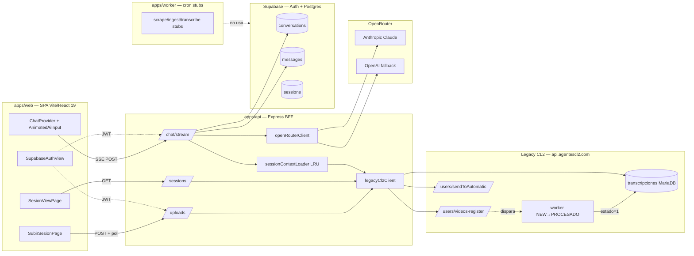

# PLATFORM_GENESIS — Génesis arquitectónica de Shift CL2

**Versión:** 1.0
**Fecha:** 2026-04-25
**Audiencia:** ingeniería senior y owners técnicos del vertical
**Estado:** documento normativo (RFC 2119 — DEBE / DEBERÍA / PUEDE)
**Alcance:** narrativa histórica y arquitectónica del vertical `shift-cl2`. NO es handoff operativo (ver [`HANDOFF-2026-04-25.md`](HANDOFF-2026-04-25.md)) ni playbook genérico de replicación (ver [`/Users/juan/Downloads/shift-ai-gateway (1)/.shifty-replication-playbook.md`](../../shift-ai-gateway%20(1)/.shifty-replication-playbook.md)).

---

## 1. Resumen ejecutivo

Shift CL2 nació en Abril 2026 como composición de **dos activos preexistentes** — Shifty Studio (scaffold UI/Cerebro propio) y el monolito legacy de `agentescl2.com` (Express + MariaDB + worker de transcripción) — bajo la presión de un único hito: la demo a Oscar Solano el **2026-05-08**. Ningún componente fue construido en greenfield. La arquitectura emergente es deliberadamente híbrida: una shell moderna (React 19 + Vite + Tailwind 4 + Cerebro SDK) que orquesta una capa BFF que envuelve al legacy como worker remoto opaco. La tesis central no es "construir mejor"; es **componer dos sistemas existentes para entregar valor verificable en tres semanas**, dejando explícito en el código qué pertenece a cada lado.

**Decisiones genéticas locked-in (ver §5 para ADRs completos):**

- Fork de Shifty Studio en `apps/web/` (no dependencia npm) para velocidad y trazabilidad de cambios.
- Proxy BFF al legacy (no migración de MariaDB) para evitar reescribir el worker `NEW→PROCESADO` de origen desconocido antes del deadline.
- Supabase nuevo para auth/persistencia (no reuso de auth legacy) por separación de tenancy y JWT moderno.
- Cerebro como capa de tools sobre `openRouterClient`, NO como reemplazo de la UI de chat.
- Turbo monorepo con `npm workspaces` (no polyrepo, no pnpm) para compartir tipos `apps/web ↔ apps/api`.
- Vite SPA (no Next.js, no SSR) — el contenido es post-auth y dinámico, SSR no aporta.

---

## 2. Estado pre-composición

Esta sección DEBE leerse como inventario verificable contra los repos físicos en el momento de la composición (2026-04-04 — fecha de inicio del fork). NO duplica el inventario completo del playbook §1.2; lista únicamente las piezas que entraron en la génesis.

### 2.1 Shifty Studio — el activo de UI

Repositorio: `/Users/juan/Downloads/shift-ai-gateway (1)/` (paradójicamente nombrado "gateway" por razones históricas — el directorio aloja el scaffold canónico Shifty Studio, NO un gateway). Estado al momento del fork:

| Pieza | Verificable en | Rol que asumió en CL2 |
|---|---|---|
| Bootstrap React 19 + Vite 6 | `package.json` líneas 36-44 | Stack base de `apps/web` |
| Chat shell monolítico | `src/components/animated-ai-input.tsx` | `apps/web/src/components/animated-ai-input.tsx` (forkeado, mínima divergencia) |
| Sidebar de historial | `src/components/sidebar.tsx` | Reusado; extendido con dos niveles (sesiones scopeadas pinneadas) |
| TopDock | `src/components/top-dock.tsx` | Reusado as-is |
| ChatProvider Zustand-flavored | `src/lib/chat-context.tsx` | Extendido con `ChatScope` y `setSessionScope()` |
| ThemeProvider | `src/lib/theme-context.tsx` | Reusado as-is |
| Supabase auth glue | `src/services/supabaseClient.ts` + `src/store/useAuthStore.ts` | Migrado a `apps/web/src/lib/supabase.ts` + `useSupabaseStore.ts` |
| MessageRenderer | `src/components/message-renderer.tsx` | Reusado; extendido con `linkifyTimecodes()` |
| Cerebro SDK plug | `src/services/sseClient.ts` + `src/services/graphApi.ts` | Migrado al BFF (`apps/api/src/services/openRouterClient.ts`) |

Lo que Shifty NO tenía y CL2 NO heredó: ningún esquema de dominio legislativo, ningún cliente para `agentescl2.com`, ninguna persona de agente Lexa/Atlas/Centinela, ningún PDF analyzer, ningún video player. El playbook §1.3 documenta normativamente esa frontera.

### 2.2 Legacy CL2 — el activo de datos e ingesta

Sistema en producción al momento de la composición: `https://api.agentescl2.com` (GCE VM `146.148.85.213`). Auditado durante el sprint pero NO modificado. Lo relevante para la génesis:

- **Endpoints públicos sin auth** consumidos por el BFF: `POST /api/users/transcripciones` (lista por ventana de fechas), `POST /api/users/videos-register` (insert), `POST /api/users/sendToAutomatic` (kick worker), `POST /api/users/youtube-mp3` (no usado por CL2 en Fase A). Verificable en `apps/api/src/services/legacyCl2Client.ts` líneas 70-116.
- **Tabla `transcripciones` MariaDB** como única fuente de verdad para: `titulo`, `youtube`, `fecha`, `duration`, `transcripcion` (URL a JSON ElevenLabs en GCS), `estado` (1 = FINALIZADA), `resumen` (markdown). Verificable en interfaz `LegacyTranscripcion` (`legacyCl2Client.ts:20-29`).
- **Worker `NEW → PROCESADO` de origen desconocido**: descarga audio de YouTube → ElevenLabs STT → genera resumen → marca `estado=1`. Tiempo típico: 5-15 min. NO hay propietario identificado, NO hay código fuente accesible, NO hay reintento automático observable. La auditoría DEBERÍA tratarse como caja negra.

Este documento NO re-lista todos los endpoints legacy. Para auditoría completa ver el archivo de auditoría externa referido en HANDOFF §2.5.

### 2.3 Lo que faltaba en cada lado

Composición = suma de carencias complementarias:

- **Shifty no tenía datos.** Cero corpus legislativo, cero historial de sesiones plenarias, cero pipeline de ingesta. Construir desde cero significaba reescribir lo que el legacy ya hace todos los días.
- **Legacy no tenía UI moderna ni Cerebro.** Frontend obsoleto, sin chat multi-agente, sin SSE, sin tool calling, sin retrieval semántico. Modernizarlo in-place requería tocar producción de Oscar.

La composición es la única jugada que entrega ambas cosas en tres semanas: UI nueva con datos viejos, sin tocar lo que ya funciona en el legacy.

---

## 3. Tesis de composición

### 3.1 Por qué fork de Shifty y no construcción desde cero

Shifty Studio ya resuelve los seis problemas que cada vertical AI debe resolver: chat shell con animación, sidebar agrupada, render markdown sanitizado, Cerebro SDK conectado, auth Supabase, theming dark/light. Construir desde cero hubiese consumido las tres semanas del sprint solo en scaffolding (estimación playbook §0). El fork preserva esas seis piezas y deja al sprint enfocarse en lo único: el dominio legislativo. La regla normativa: el vertical DEBE forkear el shell, NO reimplementarlo.

La alternativa de empaquetar Shifty como dependencia npm fue descartada explícitamente (ver ADR-G1). Resumen: forkear obliga al fork-owner a entender qué hereda; un paquete invita a wrappers que driftéan sin trazabilidad.

### 3.2 Por qué BFF proxy al legacy y no migración de MariaDB

El worker `NEW → PROCESADO` no tiene dueño identificado y procesa con éxito sesiones diarias. Migrarlo significa: (a) reverse-engineering del payload de `videos-register`, (b) reescritura del job runner, (c) re-provisión de yt-dlp + ElevenLabs + GCS bucket, (d) migración de datos históricos, (e) cutover sin downtime. Estimación conservadora: 4-6 semanas. Disponible: 3 semanas hasta demo.

La tesis: **envolver, no reescribir**. El BFF (`apps/api/src/services/legacyCl2Client.ts`) traduce llamadas modernas (Supabase JWT, JSON tipado) a llamadas legacy (REST sin auth, payload best-guess). El frontend nunca habla con MariaDB. La pipeline propia queda planificada como Fase B (HANDOFF §6) sin bloquear el demo.

### 3.3 Por qué Supabase Auth (no reuso del auth legacy)

El legacy CL2 expone endpoints públicos sin auth. Reutilizar su capa de usuarios significaba (a) construir una capa de auth nueva sobre MariaDB de todos modos o (b) exponer datos sin gating. Supabase Auth (GoTrue) ofrece JWT moderno verificable en el BFF (`apps/api/src/services/auth.ts:32-46`), preparación de RLS para Fase B, y separación limpia de tenancy: el legacy puede cambiar de auth o irse a deprecación sin afectar a CL2. Costo: mantenemos dos sistemas de identidad. Beneficio: control total sobre quién accede al BFF.

### 3.4 Por qué turbo monorepo

`apps/web` y `apps/api` comparten tipos (`packages/shared-types/src/index.ts` define `CerebroRequest`, `CerebroStreamChunk`, etc., usados en `apps/api/src/routes/chat.ts:2`). Polyrepo implicaría versionado manual o publicación a un registry interno — overhead injustificable para un equipo de 1-2 personas. Turbo + npm workspaces ofrecen build paralelo, cache local, y tipos compartidos sin duplicación. Configuración mínima en `turbo.json` (28 líneas) y `package.json:6-9`.

`pnpm` y `yarn` fueron descartados: `npm@10.9.0` ya soporta workspaces sin penalty real, y mantiene la huella de tooling pequeña (relevante para CI/CD y nuevos contributors).

---

## 4. Anatomía del repo resultante

### 4.1 Diagrama de data flow

### 4.2 Tabla por workspace

| Workspace | Origen | Responsabilidad | Archivos clave |
|---|---|---|---|
| `apps/web` | Fork de Shifty Studio (selectivo, no copia bruta) | SPA con auth Supabase, chat SSE, video player, formularios de ingesta | `src/App.tsx`, `src/components/animated-ai-input.tsx`, `src/pages/SesionesListPage.tsx`, `src/pages/SubirSesionPage.tsx`, `src/lib/chat-context.tsx` |
| `apps/api` | Nuevo (no existía en Shifty) | BFF Express: gateway a OpenRouter, proxy al legacy, persistencia Supabase, JWT verification | `src/index.ts`, `src/routes/chat.ts`, `src/routes/uploads.ts`, `src/services/legacyCl2Client.ts`, `src/services/openRouterClient.ts`, `src/services/auth.ts` |
| `apps/worker` | Nuevo (placeholders) | Cron jobs Fase B (hoy stubs `console.log`) | `src/index.ts`, `src/jobs/*.ts` |
| `packages/cerebro-config` | Nuevo (vertical-specific) | Personas YAML de Lexa, Atlas, Centinela | `agents/lexa.yaml`, `agents/atlas.yaml`, `agents/centinela.yaml` |
| `packages/shared-types` | Nuevo | Tipos TS compartidos web↔api↔worker (`CerebroRequest`, `CerebroStreamChunk`, `SessionListItem`) | `src/index.ts` |
| `infra/supabase` | Nuevo | Migraciones SQL versionadas + RLS | `migrations/0001_init.sql`, `0002_match_chunks.sql`, `0003_conversations_scope.sql` |

El BFF `apps/api` es la pieza que NO existía en Shifty. Shifty asume que el frontend habla directamente con Cerebro o un gateway externo. CL2 introduce el BFF porque la composición lo exige: alguien tiene que validar JWT, hacer rate limit, traducir al legacy, y mantener LRU de transcripciones. Esa pieza es vertical-specific por naturaleza (cada vertical envuelve un backend distinto) y por lo tanto vive en el monorepo del vertical, no upstream.

---

## 5. Decisiones genéticas (ADRs condensados)

### ADR-G1 — Fork de Shifty vs. dependencia npm

**Decisión:** Fork del scaffold completo a `apps/web/`. Las divergencias se hacen in-place; los upstream merges son manuales y opcionales.

**Contexto:** Shifty Studio es un repo de referencia, no un paquete publicado. Cada vertical podría intentar empaquetarlo (`@shift/studio`) y consumirlo como dependencia.

**Alternativas descartadas:**

- `npm install @shift/studio` con wrappers en cada vertical: invita a esconder cambios en el wrapper que después driftéan sin trazabilidad; fuerza versionado y publicación; rompe el principio "el dueño del fork debe entender lo que hereda".
- Git submodule: peor experiencia de DX que un fork, mismo overhead de sync.

**Consecuencias:** El vertical DEBE asumir el costo de portar fixes upstream manualmente. La trazabilidad es perfecta: cada divergencia es visible en el git log del vertical. Documentado normativamente en playbook §3.

### ADR-G2 — Proxy al legacy vs. reescritura del worker

**Decisión:** El BFF (`apps/api/src/services/legacyCl2Client.ts`) proxea `videos-register`, `sendToAutomatic` y `transcripciones` al legacy. El worker propio (`apps/worker/`) queda como stub para Fase B.

**Contexto:** Demo en firme 2026-05-08. Worker legacy procesa con éxito sesiones diarias. Sin propietario identificable.

**Alternativas descartadas:**

- Reescribir el pipeline (yt-dlp + ElevenLabs + resumen propio) antes de la demo: estimación 4-6 semanas, no cabe.
- Dual-write (legacy + propio): duplica costo de RapidAPI/ElevenLabs sin beneficio en MVP.

**Consecuencias:** CL2 hereda los riesgos del legacy (downtime, payload drift, bug `transcriptDocUrl`). El polling 12s con cap 30 min en `apps/web/src/pages/SubirSesionPage.tsx:35-38` reconoce explícitamente que el worker es opaco. Plan de salida documentado en HANDOFF §6.

### ADR-G3 — Supabase Auth vs. reuso de auth legacy

**Decisión:** Auth nueva sobre Supabase GoTrue. Verificación de JWT en el BFF vía `auth.getUser(token)` (`apps/api/src/services/auth.ts:32-46`). Toda escritura nueva requiere JWT válido.

**Contexto:** Legacy CL2 expone endpoints públicos sin auth.

**Alternativas descartadas:**

- Construir auth propia sobre MariaDB legacy: re-implementación completa, sin RLS, sin OAuth providers.
- Dejar el BFF sin auth (espejando legacy): inaceptable para datos de Oscar y para Fase B con escritura propia.

**Consecuencias:** Dos sistemas de identidad coexisten. Los usuarios CL2 NO se mapean 1-a-1 con usuarios legacy (el legacy ni siquiera tiene tabla de usuarios sobre los endpoints públicos relevantes). Esto DEBE renegociarse en Fase B si se decide migrar la base.

### ADR-G4 — Cerebro como capa de tools (no como reemplazo de la UI de chat)

**Decisión:** Cerebro vive en el BFF como `openRouterClient` con 2-pass tool loop. La UI consume SSE estándar, no conoce de Cerebro.

**Contexto:** Cerebro provee ejecución de grafos y herramientas multi-paso. Podría exponer su propia UI (admin dashboard, canvas).

**Alternativas descartadas:**

- Reemplazar el chat shell por la UI de Cerebro: rompe el reuso del scaffold Shifty, fuerza al usuario a aprender una nueva interfaz, sacrifica el branding del vertical.
- Cliente directo desde el frontend a Cerebro/OpenRouter: filtra credenciales al cliente, imposibilita rate limit y persistencia.

**Consecuencias:** El frontend NO necesita SDK de Cerebro. La elección de Anthropic vs OpenAI vs futuro proveedor es opaca al cliente. Cambiar Cerebro por LangGraph en Fase C requiere tocar solo `apps/api/src/services/openRouterClient.ts` y la persona YAML.

### ADR-G5 — Turbo monorepo vs. polyrepo

**Decisión:** Monorepo `npm workspaces` + `turbo` con `apps/*` y `packages/*`. Configuración en `package.json:6-9` y `turbo.json` (28 líneas).

**Contexto:** Tipos compartidos web↔api (`CerebroRequest`, `CerebroStreamChunk` en `packages/shared-types/src/index.ts`). Equipo de 1-2 personas.

**Alternativas descartadas:**

- Polyrepo con tipos publicados a registry: overhead de versionado y publicación injustificable.
- Polyrepo con copia manual de tipos: duplicación inevitable, drift garantizado.
- pnpm workspaces: ventaja de disk dedup marginal a esta escala; npm@10 ya soporta workspaces.

**Consecuencias:** Build, lint y typecheck corren coordinadamente desde la raíz (`turbo run build`). Deploy independiente por workspace sigue siendo posible (cada `apps/*` tiene su propio Dockerfile en Fase B).

### ADR-G6 — Vite SPA (no Next.js, no SSR)

**Decisión:** `apps/web` es Vite 6 + React 19 client-side rendering. Cero SSR, cero React Server Components.

**Contexto:** Toda la UI relevante de CL2 es post-auth (chat, video, listado de sesiones). El contenido es dinámico, dependiente del JWT del usuario.

**Alternativas descartadas:**

- Next.js App Router: agrega complejidad (server components, edge runtime, hydration mismatches) sin beneficio observable. No hay SEO target, no hay pre-rendering útil.
- Remix: misma objeción.

**Consecuencias:** Bundle más simple, deploy más simple (cualquier static host + el BFF Express por separado). El backend NO está acoplado al framework del frontend. Si en Fase C se decide marketing site con SSR, vivirá en repo separado.

### ADR-G7 — In-process LRU vs. Redis para cache de transcripciones

**Decisión:** Cache LRU in-process en `apps/api/src/services/legacyCl2Client.ts:196-230` (cap 20 entradas, sin TTL, eviction on write). Mismo patrón en `sessionContextLoader` (cap 50, TTL 10 min).

**Contexto:** Transcripciones ElevenLabs son blobs JSON 1-3 MB. Llamarlas en cada turno de chat satura el legacy y agrega latencia de fetch.

**Alternativas descartadas:**

- Redis: agrega dependencia infra para un caso que cabe en 60 MB de RAM.
- Sin cache: latencia de 1-3s por turno scoped, costo de banda al legacy multiplicado por turn-count.

**Consecuencias:** El cache se pierde en cada reinicio. La primera consulta scopeada post-deploy paga la latencia de fetch. Aceptable para MVP; reemplazable por Redis en Fase B sin tocar el contrato.

### ADR-G8 — Polling explícito (no WebSocket / no SSE) para upload status

**Decisión:** El frontend hace polling cada 12s a `GET /api/uploads/:legacyId/status` (`apps/web/src/pages/SubirSesionPage.tsx:35`, `91`). Cap 30 min.

**Contexto:** El worker legacy es opaco; no podemos suscribirnos a sus eventos. SSE en el BFF requeriría que el BFF mismo polleara al legacy, sin ahorro real.

**Alternativas descartadas:**

- WebSocket bidireccional: agrega infra (sticky sessions en load balancer) sin valor adicional.
- Webhook desde el legacy: el legacy no soporta webhooks.

**Consecuencias:** Patrón simple, idempotente, debuggeable. Tolerante a desconexiones (el usuario puede cerrar la pestaña; la sesión aparece en `/sesiones` cuando termine). Reemplazable por webhook real cuando exista pipeline propia (Fase B paso 4 en HANDOFF §6).

---

## 6. Patrones de composición reutilizables

Las siguientes formas son extraíbles a otros verticales que envuelvan backends legacy. NO se generalizan upstream a Shifty porque dependen de la existencia de un legacy; sí DEBERÍAN documentarse aquí como referencia para futuros forks Shift.

### 6.1 Patrón "BFF proxy + polling" para workers legacy lentos

**Cuándo aplica:** existe un sistema legacy con un worker async opaco que tarda 5-30 min y se dispara por un endpoint REST.

**Forma:**

1. Endpoint BFF que dispara el worker legacy y devuelve un `legacy_id` + `poll_url`. Ver `apps/api/src/routes/uploads.ts:52-121`.
2. Endpoint BFF de status que traduce el estado legacy a un contrato pequeño (`pending` | `ready` | `error`). Ver `apps/api/src/routes/uploads.ts:131-171`.
3. Frontend en máquina de estados con `phase: 'idle' | 'submitting' | 'polling' | 'ready' | 'error'` y `useEffect` de polling con cleanup. Ver `apps/web/src/pages/SubirSesionPage.tsx:40-103`.
4. Cap explícito de tiempo de polling con mensaje accionable cuando expira.

**Por qué funciona:** el contrato pequeño desacopla al frontend del shape interno del legacy. Cuando el legacy se reemplace por la pipeline propia, solo cambia la implementación del status endpoint, no el frontend.

### 6.2 Patrón "fork de shell UI + páginas verticales"

**Cuándo aplica:** todo nuevo vertical Shift.

**Forma:**

- Conservar sin tocar (o con cambios mínimos cosméticos): `top-dock.tsx`, `sidebar.tsx`, `animated-ai-input.tsx`, `chat-context.tsx`, `theme-context.tsx`, `message-renderer.tsx`, `error-boundary.tsx`, auth views.
- Reemplazar/agregar: `pages/*` (páginas de dominio), `services/*` con clientes vertical-specific (`uploadsApi.ts`, `sessionsApi.ts`), `lib/router.ts` con rutas del vertical.
- Composición en `App.tsx`: el router del vertical decide qué componente renderizar; las páginas reusan TopDock + Sidebar + ChatProvider sin reescribirlos. Ver `apps/web/src/App.tsx:32-101`.

**Test de contraste (ver playbook §1.3):** un componente DEBE estar en Shifty Studio si Soul (wellness vertical hipotético) podría usarlo sin cambios; DEBE estar en el vertical si menciona "sesión", "comisión", "expediente" o cualquier término del dominio.

### 6.3 Patrón "Cerebro 2-pass tool loop" para SSE con tool calls

**Cuándo aplica:** chat con herramientas de retrieval o acción declaradas en YAML.

**Forma:**

1. Pass 1 — el modelo recibe (system persona, system scope opcional, mensajes). Si pide tool call, el BFF ejecuta la tool y emite SSE chunk `tool_call` + `citation` para cada hit.
2. Pass 2 — el BFF reenvía la respuesta de la tool al modelo como mensaje `tool` y obtiene la respuesta final, streameada como `text` chunks.
3. Persistencia condicional: solo en pass 2 final el BFF persiste `messages.assistant` con `citations` jsonb.

Ver `apps/api/src/services/openRouterClient.ts` (no incluido aquí; el contrato de chunks SSE está documentado en HANDOFF §4.1-4.2).

---

## 7. Riesgos heredados de la composición

| # | Riesgo | Origen | Mitigación actual | Mitigación Fase B |
|---|---|---|---|---|
| R1 | Worker `NEW → PROCESADO` legacy sin dueño identificable | Legacy | Polling con cap 30 min + mensaje al usuario "puede aparecer en /sesiones más tarde" (`SubirSesionPage.tsx:80-83`) | Reemplazo por `youtubeFetchQueue` + `transcribeAudioQueue` propios (HANDOFF §6.2 pasos 2-3) |
| R2 | Payload de `videos-register` y `sendToAutomatic` inferido por nombres de campo (no por contrato) | Composición (auditoría incompleta) | Logging de respuesta cruda en `uploads.ts:84,89,110` para iterar | E2E test con URL real (HANDOFF D01) + documentar payload final (D02) |
| R3 | Sin RLS activo en Supabase para escritura del propio BFF | Composición (Supabase nuevo) | JWT verification obligatoria en endpoints sensibles (`auth.ts:32-46`); RLS preparado en migración 0001 | Activar RLS estricto post-demo + tests de cross-tenant access |
| R4 | Acoplamiento al monolito MariaDB para lectura de transcripciones históricas | Legacy | Cache LRU in-process reduce hits (`legacyCl2Client.ts:196`) | Migración one-off de `transcripciones` a `sessions` propias (script `scripts/migrate-cl2-mariadb.ts` ya scaffoldeado en `package.json:18`) |
| R5 | Bug conocido: `transcriptDocUrl` viene vacío en muestras `PROCESADO` del legacy | Legacy | Polling distingue `estado=1 + transcripcion presente` antes de marcar `ready` (`uploads.ts:151-156`) | Pipeline propia genera ambos campos garantizados (HANDOFF D03) |
| R6 | LRU se pierde en reinicio del BFF; primera consulta scopeada post-deploy paga latencia | Composición (cache in-process) | Aceptable para MVP; warm-up automático no implementado | Migrar a Redis o pre-cache de top-N sesiones recientes |
| R7 | Dos sistemas de identidad (Supabase + ausencia legacy); imposible mapear usuarios CL2 ↔ legacy | ADR-G3 | Aceptado: el legacy no tiene usuarios sobre los endpoints relevantes | Decidir en Fase B si la migración total elimina el problema o si se construye mapeo explícito |
| R8 | Shifty fork puede driftear sin trazabilidad si se hacen cambios in-place sin documentar el motivo | Shifty (ADR-G1) | Convención: comentarios `// shift-cl2:` en cada divergencia | Auditoría trimestral de divergencias contra upstream Shifty |

---

## 8. Trayectoria post-MVP

La demo del 2026-05-08 NO renegocia las decisiones genéticas centrales. Se mantienen post-demo:

- ADR-G1 (fork) — reemplazar el modelo de fork por package no es una decisión justificable por una demo exitosa.
- ADR-G3 (Supabase auth) — los usuarios de Oscar ya estarán creados allí.
- ADR-G4 (Cerebro como capa) — el modelo de tools dinámicos prueba su valor con `search_session_transcript` en el sprint actual.
- ADR-G5 (turbo monorepo) — invariante mientras el equipo siga siendo pequeño.
- ADR-G6 (Vite SPA) — invariante salvo decisión explícita de marketing site.

Decisiones que SE renegocian post-demo (referidas al plan Fase B en HANDOFF §6, NO replicadas aquí):

- ADR-G2 (proxy al legacy) — se ejecuta el plan de migración del worker. La meta es eliminar la dependencia operacional de `agentescl2.com` para nuevas sesiones, manteniendo el legacy como archivo histórico de solo lectura durante un período de transición.
- ADR-G7 (LRU in-process) — se evalúa Redis cuando el cache miss rate o el reinicio frecuente lo justifiquen.
- ADR-G8 (polling) — se reemplaza por webhook real cuando exista pipeline propia (`POST /webhooks/elevenlabs` planeado en HANDOFF §6.2 paso 4).

La frontera entre lo que es genético (este documento) y lo que es operacional (HANDOFF) DEBE mantenerse. Cualquier decisión que cambie alguno de los ADRs anteriores DEBE editarse aquí explícitamente con una nota de fecha y motivo.

---

## 9. Glosario y referencias cruzadas

### 9.1 Glosario

| Término | Definición operativa |
|---|---|
| **Shifty Studio** | Scaffold canónico React 19 + Vite + Tailwind 4 + shadcn + Cerebro SDK. Vive en `/Users/juan/Downloads/shift-ai-gateway (1)/`. |
| **Cerebro** | Runtime multi-agente propio de Shift / ShiftLab; expone tool calling y orquestación. Consumido por el BFF, no por el frontend. |
| **BFF** | Backend-for-Frontend. En CL2 = `apps/api/`. Capa Express que valida JWT, proxea al legacy, ejecuta tool calls, persiste en Supabase. |
| **Plenaria / Comisión / Extraordinaria** | Tipos de sesión legislativa en Costa Rica. Discriminados en `apps/web/src/pages/SubirSesionPage.tsx:29-33`. |
| **Estado=1** | Marca legacy MariaDB de "transcripción finalizada y resumen disponible". Verificado en `legacyCl2Client.ts:152`. |
| **Scope** | Mecanismo server-side por el cual una conversación queda atada a una sesión legislativa específica. Ver HANDOFF §4.1. |
| **Tool call** | Invocación de una función declarada en YAML del agente. En CL2: `search_transcripts` (RAG, hoy vacío) y `search_session_transcript` (keyword sobre sesión scopeada). |
| **Citation** | Referencia con timecode emitida vía SSE chunk `citation`. Renderizada en `CitationCards.tsx`. |
| **Vertical** | Monorepo independiente que reusa Shifty como base y define su propio dominio. CL2 es el primer vertical (ver playbook §2.1). |
| **Fase A / Fase B** | Convención CL2: Fase A = lo que va al demo 2026-05-08; Fase B = post-demo, plan en HANDOFF §6. |
| **Legacy CL2** | Sistema en producción `api.agentescl2.com` (GCE 146.148.85.213). Express + MariaDB + worker opaco. |
| **OpenRouter** | Gateway LLM (Anthropic primario, OpenAI fallback). Único punto de salida del BFF hacia modelos. |

### 9.2 Tabla de referencias cruzadas

| Concepto | Documento autoritativo | Sección |
|---|---|---|
| Por qué se compuso Shifty + Legacy | Este doc | §3 |
| Estado verificable de features pre-demo | HANDOFF | §2.1 |
| Inventario completo del scaffold Shifty | Playbook | §1.2 |
| Frontera entre Shifty y vertical | Playbook | §1.3 |
| Estructura de monorepo de un vertical | Playbook | §2.2 |
| Plan de migración del worker legacy | HANDOFF | §6 |
| Contratos de SSE (chunks, citations) | HANDOFF | §4.1, §4.2 |
| Auditoría de endpoints legacy | Doc externo `gcp-architecture.md` | (no en este repo) |
| Decisiones genéticas (ADRs) | Este doc | §5 |
| Riesgos heredados de la composición | Este doc | §7 |
| Cache LRU de transcripciones | Código | `apps/api/src/services/legacyCl2Client.ts:196-230` |
| JWT verification en BFF | Código | `apps/api/src/services/auth.ts:32-46` |
| Máquina de estados del polling de uploads | Código | `apps/web/src/pages/SubirSesionPage.tsx:40-103` |
| Composición de TopDock + Sidebar + ChatProvider | Código | `apps/web/src/App.tsx:54-101` |
| Bootstrap del BFF (rutas + middleware) | Código | `apps/api/src/index.ts:27-60` |
| Esquema Supabase inicial | Código | `infra/supabase/migrations/0001_init.sql` |
| Personas de agente | Código | `packages/cerebro-config/agents/{lexa,atlas,centinela}.yaml` |

---

**Fin del documento.** Cualquier modificación a este documento DEBE preservar la separación con HANDOFF (operacional) y playbook (genérico). Para decisiones nuevas que cambien la génesis, agregar un ADR a §5 con nota de fecha; para decisiones operacionales del sprint, editar HANDOFF.
